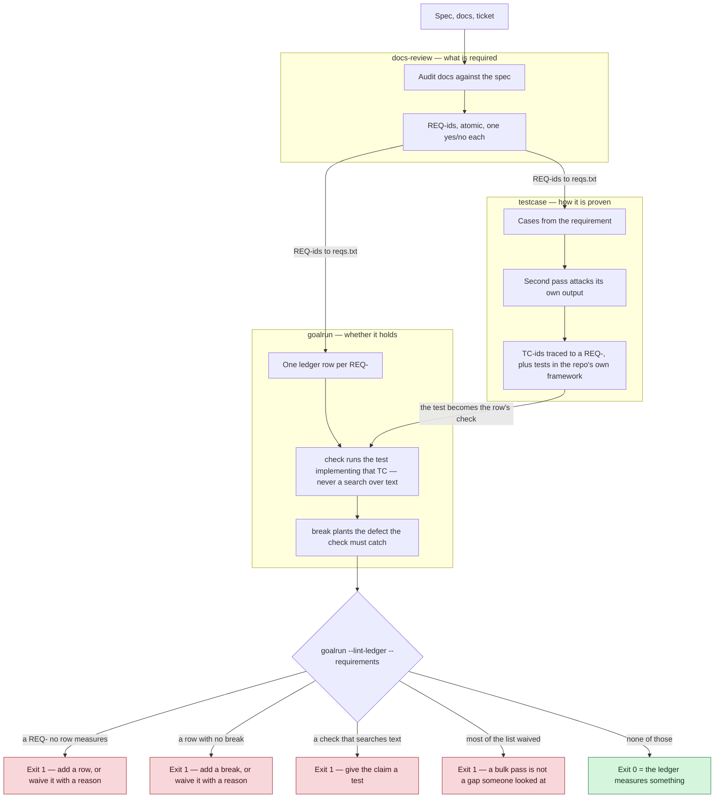
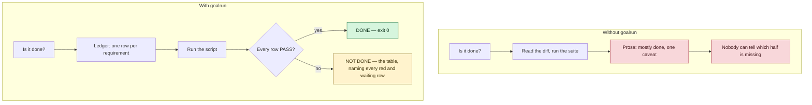
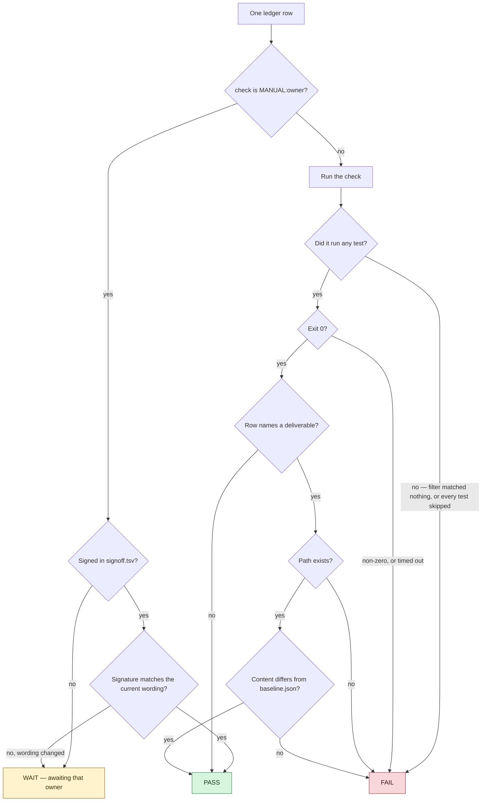
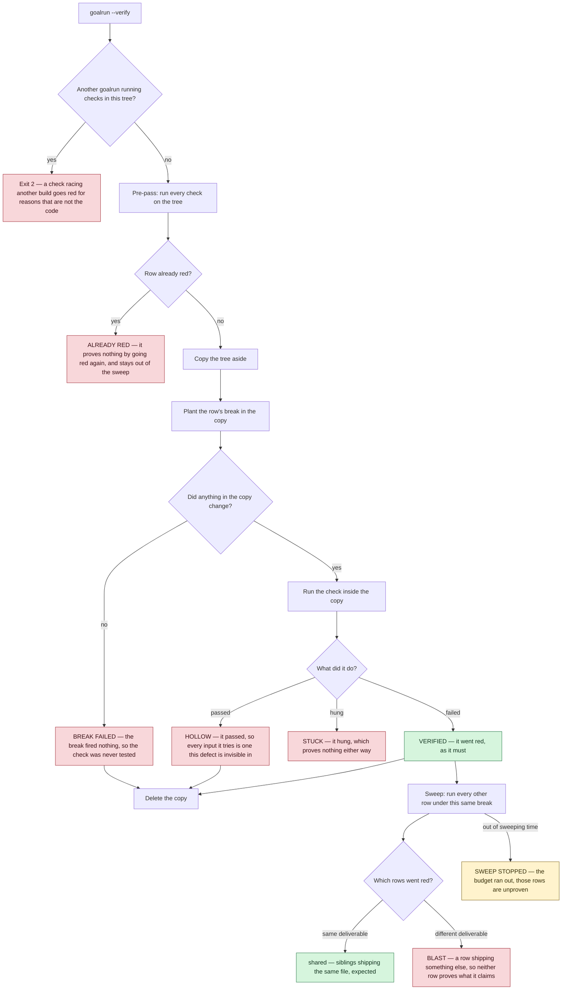

# How these skills work

[Tiếng Việt](how-it-works.vi.md)

Four pictures. Everything here is drawn from the skills' own `SKILL.md` files.

## 1. The pipeline

`docs-review` says what is required, `testcase` says how it is proven, `goalrun` says whether
it holds. Each stage hands the next a set of ids, and each boundary has a gate that fails
rather than passing in silence.

## 2. What changes

The left column is what "done" costs when nothing measures it.

## 3. How one row is decided

A row belongs to a command or to a person, never both. The exit code is the answer. A
deliverable is measured by content: `touch` changes a timestamp and ships nothing.

## 4. Proving the checks themselves

A green row proves nothing until its check has been shown able to go red. `--verify` copies the
tree, plants the row's `break` in the copy, and demands the check fail there — your own files
are read, never written. The sweep then asks whether any other row failed for the same defect,
which would mean neither can tell one defect from another.

Every box above is a string the script actually prints. `HOLLOW`, `STUCK`, `BLAST`,
`ALREADY RED`, `BREAK FAILED`, `NOTHING VERIFIED` and `SWEEP STOPPED` all exit 1: a run that
proved nothing is not a pass.

`HOLLOW` is the one that is not about the row. It says the check cannot tell the correct
behaviour from the defect — every input it tries is an input this defect is invisible in. The
route back is into `testcase`, whose `Distinguishes from` column names the wrong implementation
each case rules out, never forwards into the ledger by re-pointing the row.
