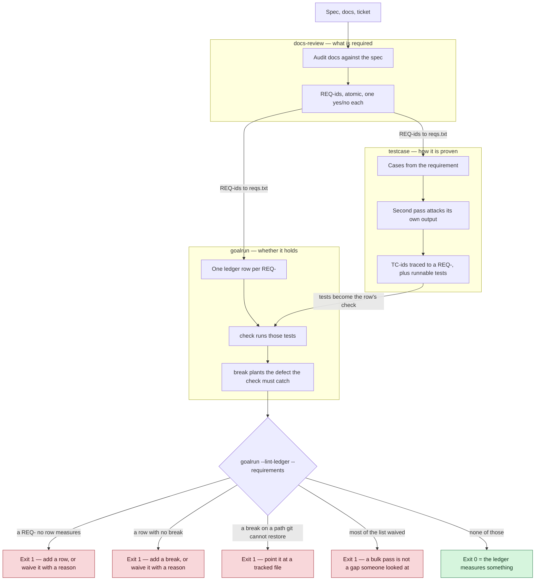
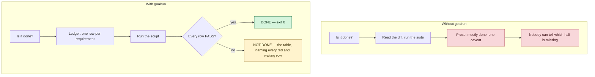
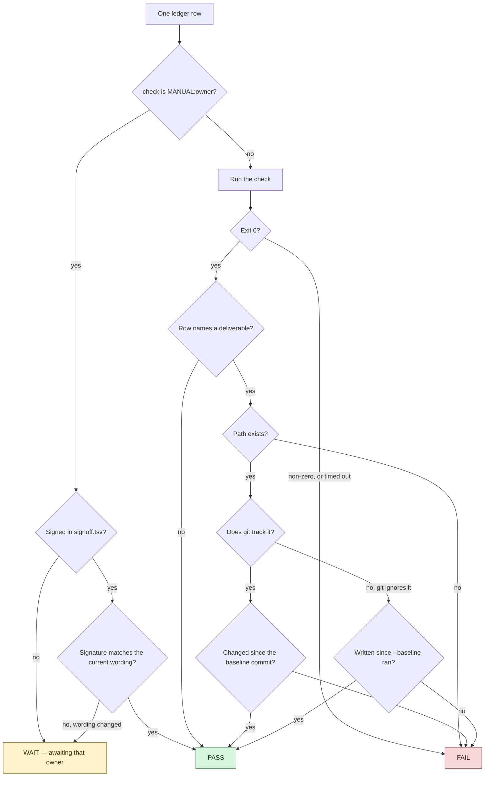
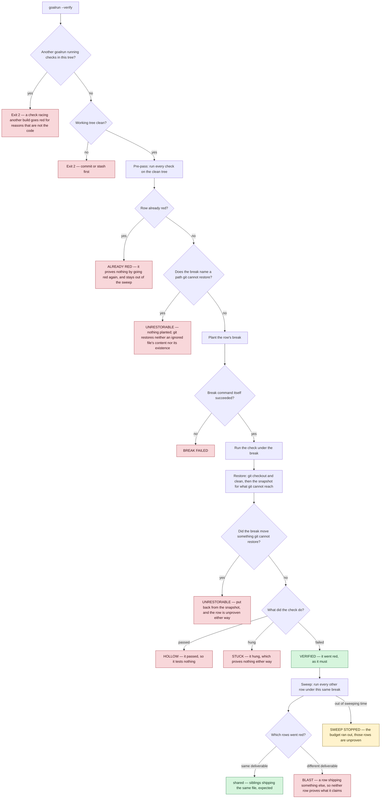

# How these skills work

[Tiếng Việt](how-it-works.vi.md)

Four pictures. Everything here is drawn from the skills' own `SKILL.md` files.

## 1. The pipeline

`docs-review` says what is required, `testcase` says how it is proven, `goalrun` says whether
it holds. Each stage hands the next a set of ids, and each boundary has a gate that fails
rather than passing in silence.

## 2. What changes

The left column is what "done" costs when nothing measures it.

## 3. How one row is decided

A row belongs to a command or to a person, never both. The exit code is the answer. A
deliverable git tracks is measured by git; one it ignores has no history to read, so it is
measured by the weaker standard of mtime — which is why the rule is to track the artifact.

## 4. Proving the checks themselves

A green row proves nothing until its check has been shown able to go red. `--verify` plants
each row's `break` and demands the check fail; the sweep then asks whether any other row
failed for the same defect, which would mean neither can tell one defect from another.

Every box above is a string the script actually prints. `HOLLOW`, `STUCK`, `BLAST`,
`ALREADY RED`, `UNRESTORABLE`, `NOTHING VERIFIED` and `SWEEP STOPPED` all exit 1: a run that
proved nothing is not a pass.

`UNRESTORABLE` is the one that is not about the check at all. `--verify` restores with `git
checkout` and `git clean`, which reach neither the content nor the existence of a file git
ignores — so a break that deletes an ignored report destroys it, and one that rewrites a check
script under `.testcases/` leaves the row measuring less than the ledger says, past the end of
the run. A break naming such a path is refused before anything is planted; what a break reaches
indirectly is put back from a snapshot taken beforehand, and the row stays unproven until the
break points at a file git can restore.
