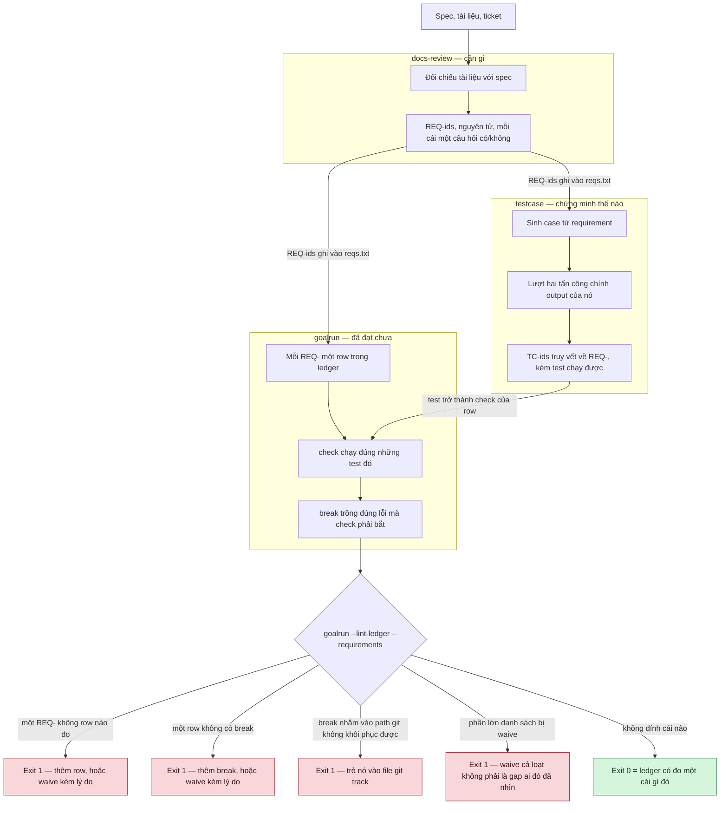
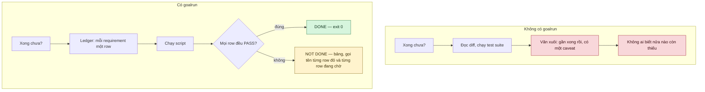
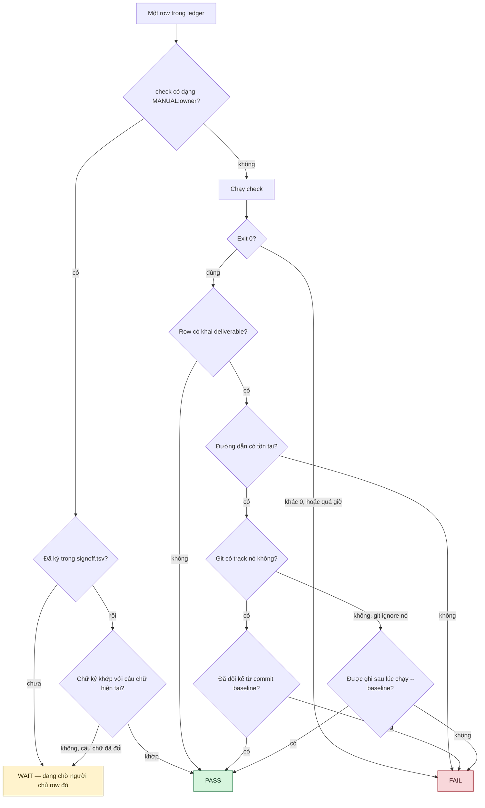
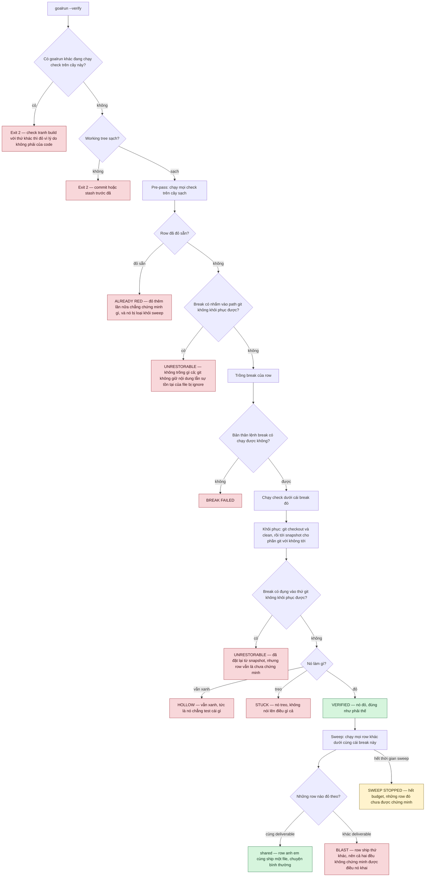

# Các skill này làm việc thế nào

[English](how-it-works.md)

Bốn hình. Mọi thứ ở đây lấy từ chính `SKILL.md` của các skill.

## 1. Chuỗi ba skill

`docs-review` nói **cần gì**, `testcase` nói **chứng minh thế nào**, `goalrun` nói **đã đạt
chưa**. Mỗi chặng bàn giao cho chặng sau một tập id, và mỗi biên có một cổng chặn — nó fail
chứ không im lặng cho qua.

## 2. Khác biệt nằm ở đâu

Cột trái là cái giá của chữ "xong" khi không có gì đo nó.

## 3. Một row được quyết thế nào

Một row thuộc về **một câu lệnh** hoặc **một con người**, không bao giờ cả hai. Exit code
chính là câu trả lời. Deliverable được git track thì git đo; cái git ignore không có lịch sử
để đọc nên phải đo bằng chuẩn yếu hơn là mtime — đó là lý do luật là hãy track cái artifact.

## 4. Chứng minh chính những cái check

Một row xanh chưa chứng minh được gì cho tới khi check của nó được cho thấy là **có thể đỏ**.
`--verify` trồng `break` của từng row và bắt check phải fail; sau đó sweep hỏi xem có row nào
khác cũng đỏ vì đúng lỗi đó không — nếu có thì cả hai đều không phân biệt nổi lỗi này với lỗi
của chính mình.

Mỗi ô ở trên là một chuỗi mà script **thật sự in ra**. `HOLLOW`, `STUCK`, `BLAST`,
`ALREADY RED`, `UNRESTORABLE`, `NOTHING VERIFIED` và `SWEEP STOPPED` đều exit 1: một lần chạy
không chứng minh được gì thì không phải là pass.

`UNRESTORABLE` là cái duy nhất không nói về check. `--verify` khôi phục bằng `git checkout` và
`git clean`, mà hai lệnh đó không với tới nội dung lẫn sự tồn tại của file git ignore — nên một
break xoá report bị ignore là mất hẳn, còn break sửa một check script dưới `.testcases/` thì để
row đo ít hơn những gì ledger nói, kéo dài qua hết cả lần chạy. Break nào **gọi tên** một path
như vậy bị từ chối trước khi trồng bất cứ thứ gì; thứ break với tới gián tiếp thì được đặt lại
từ snapshot chụp trước đó, và row vẫn là chưa chứng minh cho tới khi break trỏ vào file git
khôi phục được.
