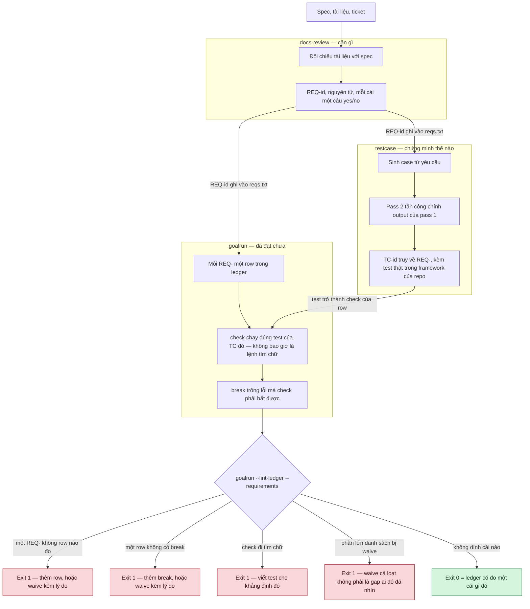
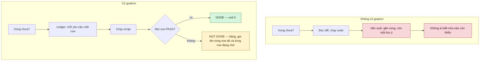
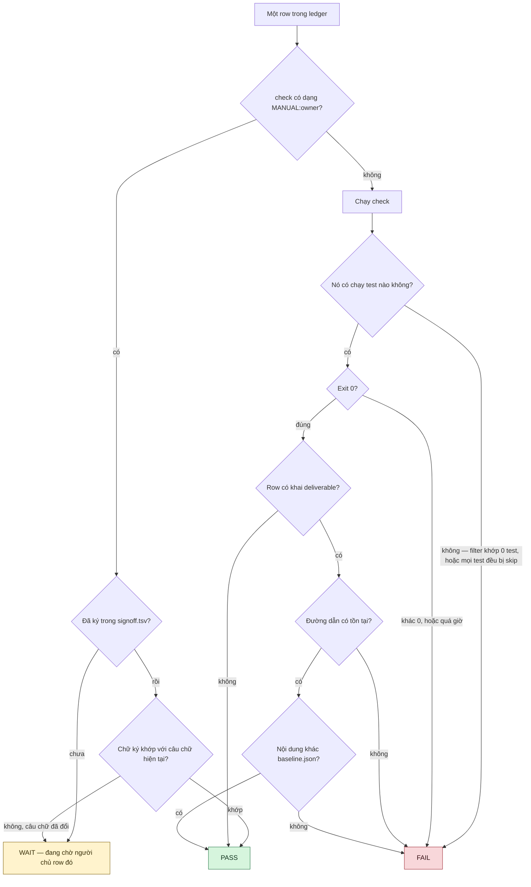
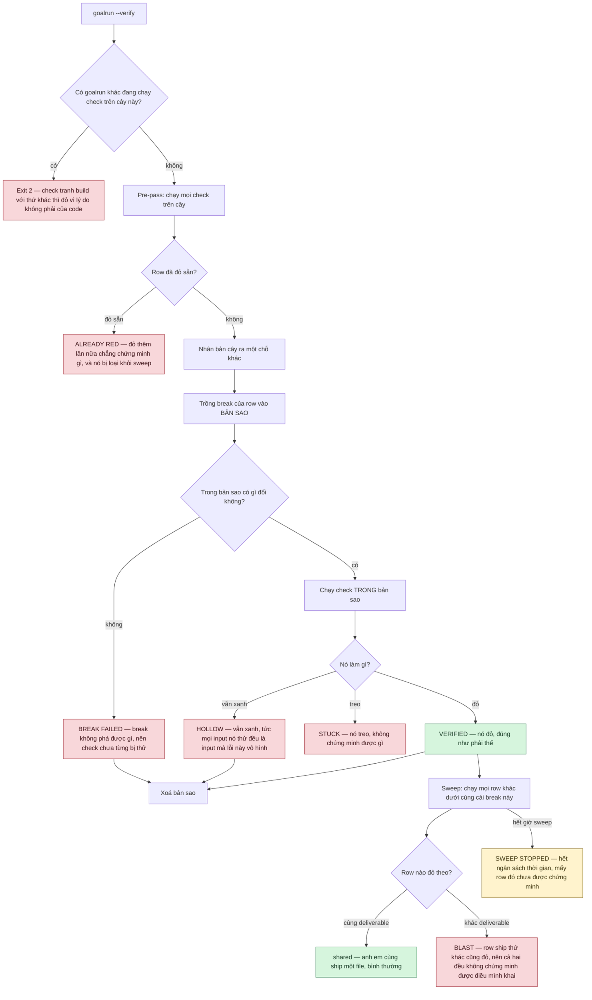

# Các skill này làm việc thế nào

[English](how-it-works.md)

Bốn bức hình. Mọi thứ ở đây rút ra từ chính `SKILL.md` của các skill.

## 1. Dây chuyền

`docs-review` nói **cần gì**, `testcase` nói **chứng minh thế nào**, `goalrun` nói **đã đạt
chưa**. Mỗi chặng giao cho chặng sau một bộ id, và mỗi ranh giới có một cổng — hụt thì đỏ, chứ
không im lặng cho qua.

## 2. Khác gì

Cột trái là cái giá của "xong" khi không có gì đo nó.

## 3. Một row được quyết thế nào

Một row thuộc về **một câu lệnh** hoặc **một con người**, không bao giờ cả hai. Exit code chính
là câu trả lời. Deliverable đo bằng **nội dung**: `touch` chỉ đổi giờ, không ship gì cả.

## 4. Chứng minh chính những cái check

Một row xanh chưa chứng minh được gì cho tới khi check của nó được cho thấy là **có thể đỏ**.
`--verify` **nhân bản cây**, trồng `break` vào bản sao, và bắt check phải fail ở đó — file của
bạn chỉ bị đọc, không bị ghi. Sau đó sweep hỏi xem có row nào khác cũng đỏ vì đúng lỗi đó
không — nếu có thì cả hai đều không phân biệt nổi lỗi này với lỗi của chính mình.

Mỗi ô ở trên là một chuỗi mà script **thật sự in ra**. `HOLLOW`, `STUCK`, `BLAST`,
`ALREADY RED`, `BREAK FAILED`, `NOTHING VERIFIED` và `SWEEP STOPPED` đều exit 1: một lần chạy
không chứng minh được gì thì không phải là pass.

`HOLLOW` là cái duy nhất không nói về row. Nó nói check không phân biệt được hành vi đúng với
khiếm khuyết — mọi input nó thử đều là input mà lỗi này vô hình. Đường về là **ngược lên
`testcase`**, nơi cột `Distinguishes from` gọi tên implementation sai mà mỗi case loại trừ —
chứ không phải đi xuôi vào ledger để sửa row.
