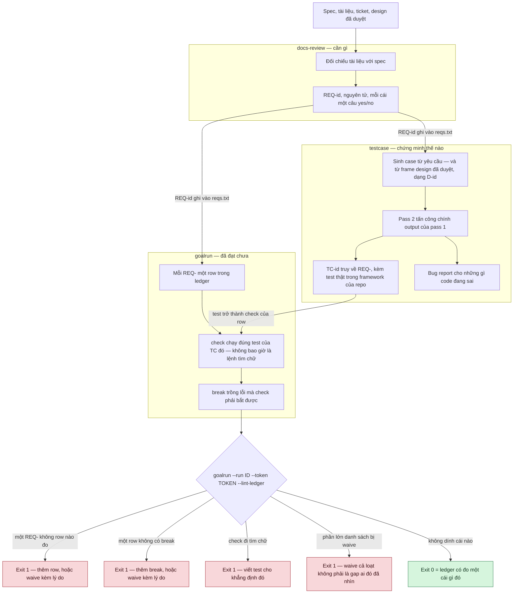
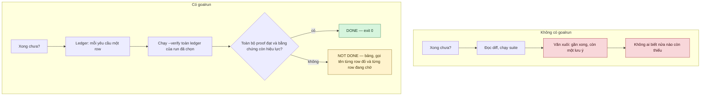
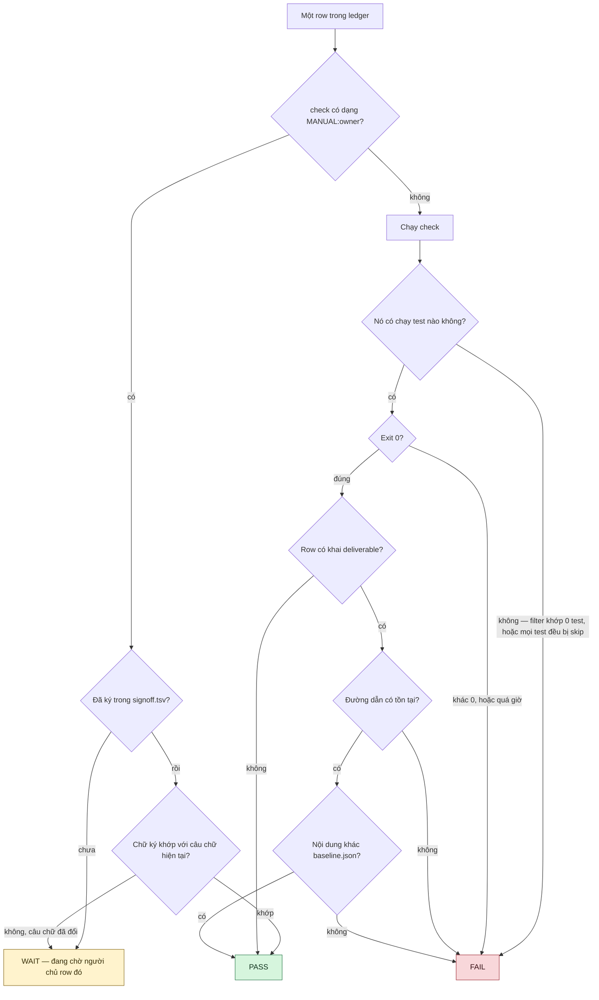
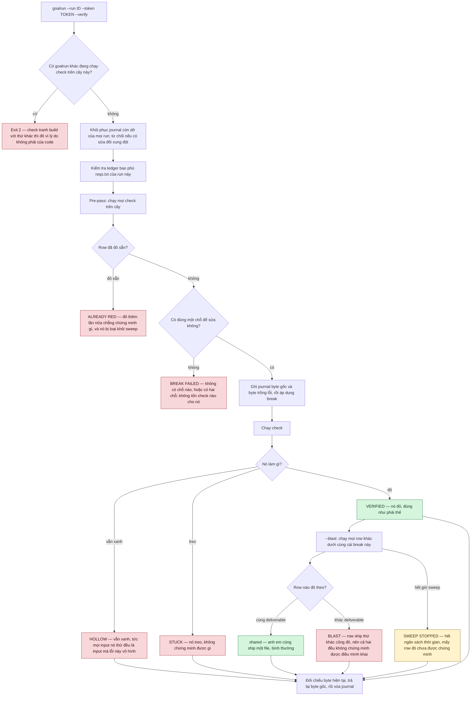
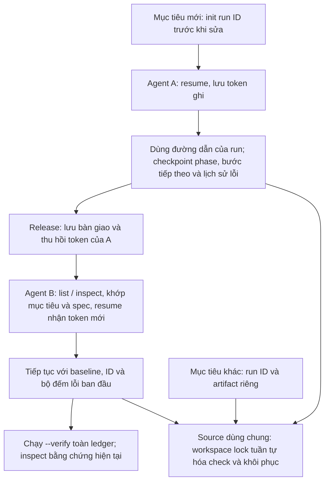

# Các skill này làm việc thế nào

[English](how-it-works.md)

Năm sơ đồ. Mọi thứ ở đây rút ra từ chính `SKILL.md` của các skill.

## 1. Dây chuyền

`docs-review` nói **cần gì**, `testcase` nói **chứng minh thế nào**, `goalrun` nói **đã đạt
chưa**. Mỗi chặng giao cho chặng sau một bộ id, và mỗi ranh giới có một cổng — hụt thì đỏ, chứ
không im lặng cho qua. Cả ba chặng dùng cùng một run ID được chọn rõ ràng;
requirement, report và đầu vào ledger được lưu riêng theo run đó.

```mermaid
flowchart TD
    SPEC["Spec, tài liệu, ticket, design đã duyệt"]

    subgraph DR["docs-review — cần gì"]
        DR1["Đối chiếu tài liệu với spec"]
        DR2["REQ-id, nguyên tử, mỗi cái một câu yes/no"]
        DR1 --> DR2
    end

    subgraph TC["testcase — chứng minh thế nào"]
        TC1["Sinh case từ yêu cầu — và từ frame design đã duyệt, dạng D-id"]
        TC2["Pass 2 tấn công chính output của pass 1"]
        TC3["TC-id truy về REQ-, kèm test thật trong framework của repo"]
        TC4["Bug report cho những gì code đang sai"]
        TC1 --> TC2 --> TC3
        TC2 --> TC4
    end

    subgraph GR["goalrun — đã đạt chưa"]
        GR1["Mỗi REQ- một row trong ledger"]
        GR2["check chạy đúng test của TC đó — không bao giờ là lệnh tìm chữ"]
        GR3["break trồng lỗi mà check phải bắt được"]
        GR1 --> GR2 --> GR3
    end

    GATE{"goalrun --run ID --token TOKEN --lint-ledger"}
    OUT["Exit 0 = ledger có đo một cái gì đó"]

    SPEC --> DR1
    DR2 -->|"REQ-id ghi vào reqs.txt"| TC1
    DR2 -->|"REQ-id ghi vào reqs.txt"| GR1
    TC3 -->|"test trở thành check của row"| GR2
    GR3 --> GATE
    GATE -->|"một REQ- không row nào đo"| FAIL1["Exit 1 — thêm row, hoặc waive kèm lý do"]
    GATE -->|"một row không có break"| FAIL2["Exit 1 — thêm break, hoặc waive kèm lý do"]
    GATE -->|"check đi tìm chữ"| FAIL3["Exit 1 — viết test cho khẳng định đó"]
    GATE -->|"phần lớn danh sách bị waive"| FAIL4["Exit 1 — waive cả loạt không phải là gap ai đó đã nhìn"]
    GATE -->|"không dính cái nào"| OUT

    style OUT fill:#d6f5dd,stroke:#2f7d4f,color:#12351f
    style FAIL1 fill:#f8d7da,stroke:#a3303b,color:#3b1015
    style FAIL2 fill:#f8d7da,stroke:#a3303b,color:#3b1015
    style FAIL3 fill:#f8d7da,stroke:#a3303b,color:#3b1015
    style FAIL4 fill:#f8d7da,stroke:#a3303b,color:#3b1015
```

`normalize` không phải một stage. Nó đứng trước, cho người cần biến một yêu cầu lan man thành
prompt: cái gì phải đúng một bên, cách làm một bên. Đo thử làm bước nạp vào `goalrun`, nó làm
rơi requirement mà yêu cầu gốc vẫn giữ — và requirement không có row thì pass trong im lặng —
nên pipeline đọc thẳng yêu cầu gốc.

## 2. Khác gì

Cột trái là cái giá của "xong" khi không có gì đo nó.

```mermaid
flowchart TD
    subgraph WITHOUT["Không có goalrun"]
        W1["Xong chưa?"]
        W2["Đọc diff, chạy suite"]
        W3["Văn xuôi: gần xong, còn một lưu ý"]
        W4["Không ai biết nửa nào còn thiếu"]
        W1 --> W2 --> W3 --> W4
    end

    subgraph WITH["Có goalrun"]
        G1["Xong chưa?"]
        G2["Ledger: mỗi yêu cầu một row"]
        G3["Chạy --verify toàn ledger của run đã chọn"]
        G4{"Toàn bộ proof đạt và bằng chứng còn hiệu lực?"}
        G5["DONE — exit 0"]
        G6["NOT DONE — bảng, gọi tên từng row đỏ và từng row đang chờ"]
        G1 --> G2 --> G3 --> G4
        G4 -->|"có"| G5
        G4 -->|"không"| G6
    end

    style W3 fill:#f8d7da,stroke:#a3303b,color:#3b1015
    style W4 fill:#f8d7da,stroke:#a3303b,color:#3b1015
    style G5 fill:#d6f5dd,stroke:#2f7d4f,color:#12351f
    style G6 fill:#fff3cd,stroke:#8a6d1f,color:#3b2f08
```

## 3. Một row được quyết thế nào

Một row thuộc về **một câu lệnh** hoặc **một con người**, không bao giờ cả hai. Exit code chính
là câu trả lời. Deliverable đo bằng **nội dung**: `touch` chỉ đổi giờ, không ship gì cả.

```mermaid
flowchart TD
    ROW["Một row trong ledger"]
    KIND{"check có dạng MANUAL:owner?"}

    SIG{"Đã ký trong signoff.tsv?"}
    HASH{"Chữ ký khớp với câu chữ hiện tại?"}
    WAIT["WAIT — đang chờ người chủ row đó"]

    RUN["Chạy check"]
    RAN{"Nó có chạy test nào không?"}
    CODE{"Exit 0?"}
    DELIV{"Row có khai deliverable?"}
    EXISTS{"Đường dẫn có tồn tại?"}
    SHIPPED{"Nội dung khác baseline.json?"}

    PASS["PASS"]
    FAIL["FAIL"]

    ROW --> KIND
    KIND -->|"có"| SIG
    SIG -->|"chưa"| WAIT
    SIG -->|"rồi"| HASH
    HASH -->|"không, câu chữ đã đổi"| WAIT
    HASH -->|"khớp"| PASS

    KIND -->|"không"| RUN
    RUN --> RAN
    RAN -->|"không — filter khớp 0 test, hoặc mọi test đều bị skip"| FAIL
    RAN -->|"có"| CODE
    CODE -->|"khác 0, hoặc quá giờ"| FAIL
    CODE -->|"đúng"| DELIV
    DELIV -->|"không"| PASS
    DELIV -->|"có"| EXISTS
    EXISTS -->|"không"| FAIL
    EXISTS -->|"có"| SHIPPED
    SHIPPED -->|"không"| FAIL
    SHIPPED -->|"có"| PASS

    style PASS fill:#d6f5dd,stroke:#2f7d4f,color:#12351f
    style FAIL fill:#f8d7da,stroke:#a3303b,color:#3b1015
    style WAIT fill:#fff3cd,stroke:#8a6d1f,color:#3b2f08
```

## 4. Chứng minh chính những cái check

Một row xanh chưa chứng minh được gì cho tới khi check của nó được cho thấy là **có thể đỏ**.
`--verify` **tự sửa** đúng chỗ mà `break` mô tả, bắt check phải fail, rồi ghi trả lại file
nguyên xi từng byte — không nhân bản gì cả. Nó chạy **một lần**, sau khi row cuối cùng đã xanh: row mà code
chưa tồn tại thì chỉ ra `ALREADY RED`, còn chi phí là một check mỗi row — chạy theo từng phase
là trả hai lần. `--blast` thêm phần sweep: chạy mọi row khác dưới cùng cái break đó, để hỏi hai
row có phân biệt nổi lỗi của nhau không. Nó tốn một check mỗi row mỗi row, nên phải gõ mới có.

```mermaid
flowchart TD
    V["goalrun --run ID --token TOKEN --verify"]
    LOCK{"Có goalrun khác đang chạy check trên cây này?"}
    STOPL["Exit 2 — check tranh build với thứ khác thì đỏ vì lý do không phải của code"]

    RECOVER["Khôi phục journal còn dở của mọi run; từ chối nếu có sửa đổi xung đột"]
    LINT["Kiểm tra ledger bao phủ reqs.txt của run này"]
    PRE["Pre-pass: chạy mọi check trên cây"]
    RED{"Row đã đỏ sẵn?"}
    AR["ALREADY RED — đỏ thêm lần nữa chẳng chứng minh gì, và nó bị loại khỏi sweep"]

    PLANT["Ghi journal byte gốc và byte trồng lỗi, rồi áp dụng break"]
    MOVED{"Có đúng một chỗ để sửa không?"}
    BF["BREAK FAILED — không có chỗ nào, hoặc có hai chỗ; không tốn check nào cho nó"]

    CHECK["Chạy check"]
    RESULT{"Nó làm gì?"}
    HOLLOW["HOLLOW — vẫn xanh, tức mọi input nó thử đều là input mà lỗi này vô hình"]
    STUCK["STUCK — nó treo, không chứng minh được gì"]
    VERIFIED["VERIFIED — nó đỏ, đúng như phải thế"]
    DROP["Đối chiếu byte hiện tại, trả lại byte gốc, rồi xóa journal"]

    SWEEP["--blast: chạy mọi row khác dưới cùng cái break này"]
    SIB{"Row nào đỏ theo?"}
    SHARED["shared — anh em cùng ship một file, bình thường"]
    BLAST["BLAST — row ship thứ khác cũng đỏ, nên cả hai đều không chứng minh được điều mình khai"]
    BUDGET["SWEEP STOPPED — hết ngân sách thời gian, mấy row đó chưa được chứng minh"]

    V --> LOCK
    LOCK -->|"có"| STOPL
    LOCK -->|"không"| RECOVER
    RECOVER --> LINT --> PRE
    PRE --> RED
    RED -->|"đỏ sẵn"| AR
    RED -->|"không"| MOVED
    MOVED -->|"không"| BF
    MOVED -->|"có"| PLANT
    PLANT --> CHECK
    CHECK --> RESULT
    RESULT -->|"vẫn xanh"| HOLLOW
    RESULT -->|"treo"| STUCK
    RESULT -->|"đỏ"| VERIFIED
    VERIFIED --> SWEEP
    SWEEP --> SIB
    SIB -->|"cùng deliverable"| SHARED
    SIB -->|"khác deliverable"| BLAST
    SWEEP -->|"hết giờ sweep"| BUDGET
    VERIFIED --> DROP
    HOLLOW --> DROP
    STUCK --> DROP
    SHARED --> DROP
    BLAST --> DROP
    BUDGET --> DROP

    style VERIFIED fill:#d6f5dd,stroke:#2f7d4f,color:#12351f
    style SHARED fill:#d6f5dd,stroke:#2f7d4f,color:#12351f
    style HOLLOW fill:#f8d7da,stroke:#a3303b,color:#3b1015
    style STUCK fill:#f8d7da,stroke:#a3303b,color:#3b1015
    style BLAST fill:#f8d7da,stroke:#a3303b,color:#3b1015
    style BF fill:#f8d7da,stroke:#a3303b,color:#3b1015
    style AR fill:#f8d7da,stroke:#a3303b,color:#3b1015
    style STOPL fill:#f8d7da,stroke:#a3303b,color:#3b1015
    style BUDGET fill:#fff3cd,stroke:#8a6d1f,color:#3b2f08
```

Các verdict mô tả kết quả script quan sát được. `HOLLOW`, `STUCK`, `BLAST`,
`ALREADY RED`, `BREAK FAILED`, `NOTHING VERIFIED` và `SWEEP STOPPED` đều exit 1: một lần chạy
không chứng minh được gì thì không phải là pass.

`HOLLOW` là cái duy nhất không nói về row. Nó nói check không phân biệt được hành vi đúng với
khiếm khuyết — mọi input nó thử đều là input mà lỗi này vô hình. Đường về là **ngược lên
`testcase`**, nơi cột `Distinguishes from` gọi tên implementation sai mà mỗi case loại trừ —
chứ không phải đi xuôi vào ledger để sửa row.

## 5. Run độc lập và bàn giao giữa agent

Khởi tạo run trước khi sửa source. Mỗi mục tiêu có requirement, ledger, baseline, chữ ký,
report và checkpoint riêng trong `.testcases/runs/<id>/`. Trạng thái làm việc được loại khỏi
git; bảng test case được đưa vào repo tại `docs/testcases/<id>/testcases.md`, còn test thực thi
nằm trong framework test của repo. `docs-review` và `testcase` cũng dùng những đường dẫn này
khi được gọi riêng.

```mermaid
flowchart TD
    NEW["Mục tiêu mới: init run ID trước khi sửa"]
    A["Agent A: resume, lưu token ghi"]
    WORK["Dùng đường dẫn của run; checkpoint phase, bước tiếp theo và lịch sử lỗi"]
    RELEASE["Release: lưu bàn giao và thu hồi token của A"]
    B["Agent B: list / inspect, khớp mục tiêu và spec, resume nhận token mới"]
    CONT["Tiếp tục với baseline, ID và bộ đếm lỗi ban đầu"]
    PROOF["Chạy --verify toàn ledger; inspect bằng chứng hiện tại"]
    OTHER["Mục tiêu khác: run ID và artifact riêng"]
    SOURCE["Source dùng chung: workspace lock tuần tự hóa check và khôi phục"]

    NEW --> A --> WORK --> RELEASE --> B --> CONT --> PROOF
    OTHER --> SOURCE
    WORK --> SOURCE
    CONT --> SOURCE
```

Quyền sở hữu không tự hết hạn. Khi agent bị crash, đọc generation hiện tại, xác định agent cũ
và các tiến trình check đã dừng, rồi tiếp quản rõ ràng bằng `--expected-generation`. Subagent
nhận đường dẫn đã chọn và vai trò được giao; controller giữ token và ghi nhận kết quả.

Agent mới phải verify lại. Source, spec, test hoặc đầu vào chính của run thay đổi cũng làm
bằng chứng cũ hết hiệu lực. Đo thông thường hoặc check một phần chưa đủ để báo hoàn thành:
inspect phải có `last_proof.whole_ledger_verified: true` và `proof_stale: false`. Row MANUAL đã được
người phụ trách xác nhận và waiver test-first rõ ràng có thể đạt mà không cần trồng lỗi.
Sửa file trực tiếp và build bên ngoài vẫn cần phối hợp vì dùng chung source và không dùng
lock của công cụ.

Xem [run context](../.agents/skills/goalrun/references/run-context.md) để biết lệnh, khôi phục
và migrate trạng thái cũ. Tiếp tục trong cùng workspace có đường dẫn chuẩn giữ được trạng thái
bị ignore; clone hoặc chuyển workspace cần chuyển trạng thái và migrate rõ ràng.
